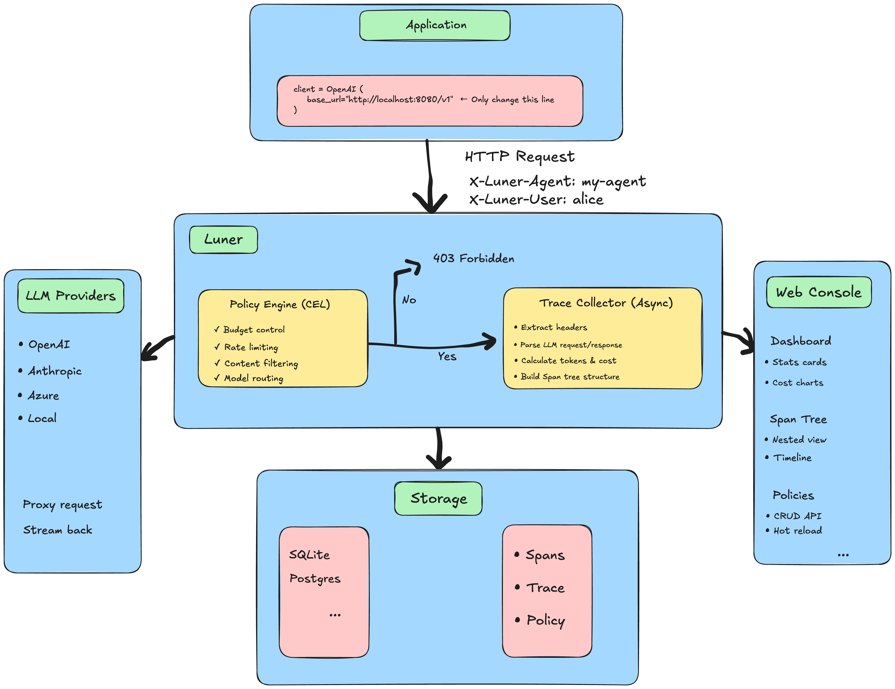
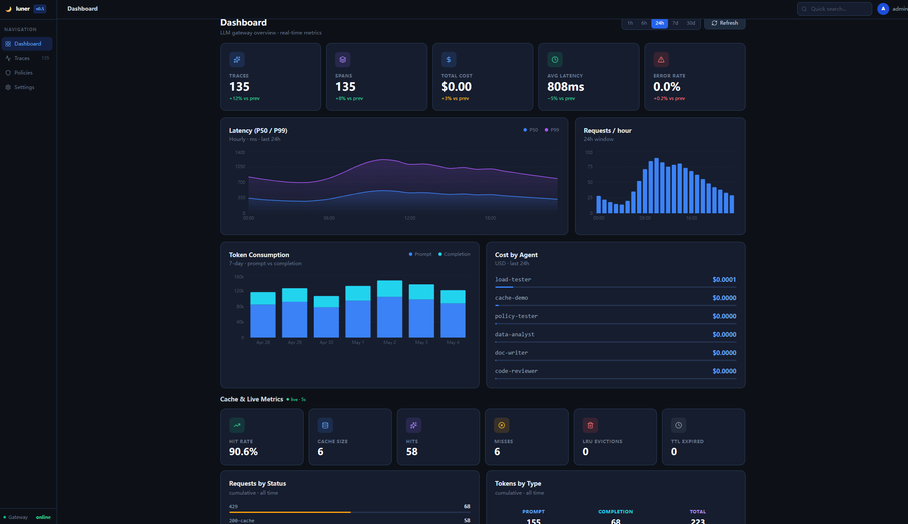
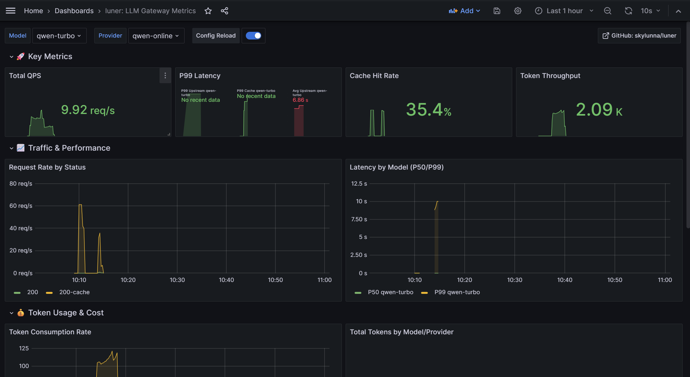

# luner

<p align="center">
  <strong>English</strong> | <a href="README.zh.md">中文</a>
</p>

[](https://github.com/skylunna/luner/releases)
[](https://go.dev/)
[](https://docs.docker.com/compose/)
[](https://github.com/skylunna/luner/blob/main/LICENSE)

**AI Gateway with real-time governance** — Block bad LLM requests before they cost you money.

Proxy, cache, rate limit, and observe your AI workloads through an OpenAI-compatible interface. 
Built-in CEL policy engine enforces budgets and model allowlists BEFORE requests reach your LLM provider.

---
## Architecture


---

## ✨ Features

### CEL Policy Engine — Enforce Before Spending

Real-time governance with Google CEL expressions:

```json
// Block requests over budget
{ "expression": "cost_usd > 10.0", "action": "block" }

// Auto-downgrade expensive models  
{ "expression": "request_count > 100 && model == 'gpt-4o'", "action": "downgrade" }

// Alert on suspicious patterns
{ "expression": "tokens_used > 50000", "action": "alert" }
```

Policies are stored in SQLite and hot-reloaded without restart. Enforce model allowlists, per-user spend caps, or custom routing logic.

---
### OpenAI Compatible
Drop-in `base_url` replacement. Works with any OpenAI-compatible SDK.

### LRU Cache
 — Zero-dependency in-memory cache with configurable TTL. Non-streaming requests only; key includes `model + messages + temperature`.

### Token-Bucket Rate Limiting
Per-provider QPS + burst controls. Instant 429 on overflow.

### Full Observability

OpenTelemetry tracing (OTLP) + Prometheus metrics. Span-level cost attribution stored in SQLite.

### Built-in Web Console

Dark-theme React SPA served on the same port. Dashboard, Traces explorer, Policies CRUD, Settings viewer — no separate deployment.

### Hot-Reload Config

`fsnotify` + `atomic.Pointer[Config]` swap routing tables with zero downtime.

### Cloud-Native

Multi-arch binaries, multi-stage Dockerfile, `docker-compose` bundles.

---

## 🚀 Quick Start

[](https://github.com/skylunna/luner/releases)

### Option 1: Demo Mode — one command, instant dashboard (recommended for evaluation)

```bash
git clone https://github.com/skylunna/luner.git
cd luner

# Build image and start everything (mock LLM + luner + seed data)
docker compose up -d --build

# Wait ~30 seconds for the image build and seed step
docker compose logs -f seed-data   # watch until "Demo data ready"
```

Open **http://localhost:8080** — you'll see a pre-loaded trace timeline, cost charts, and a live policy list.

```bash
# Verify
curl http://localhost:8080/api/health
curl http://localhost:8080/api/dashboard/summary

# Stop and clean up
docker compose down            # keeps data volume
docker compose down -v         # also removes the database
```

### Option 2: Production Mode — real LLM providers

Supports any OpenAI-compatible provider. The default production config uses Alibaba Qwen; swap in OpenAI or any other provider by editing `deployments/production/config.prod.yaml`.

```bash
# Copy your secrets to the project root .env file
echo "DASHSCOPE_API_KEY=sk-..." > .env      # Alibaba Qwen
# echo "OPENAI_API_KEY=sk-..." >> .env       # OpenAI (uncomment in config.prod.yaml)

cd deployments/production
docker compose -f docker-compose.prod.yml up -d --build
```

### Option 3: From Source

```bash
make build                          # builds web + Go binary
./bin/luner --config config/config.example.yaml
```

### Option 4: With Full Monitoring Stack (Prometheus + Grafana + Tempo)

```bash
docker compose -f docker-compose.yml -f docker-compose.monitoring.yml up -d
# Grafana:    http://localhost:3000  (admin / admin)
# Prometheus: http://localhost:9091
```

### Troubleshooting

| Symptom | Fix |
|---|---|
| `seed-data` exits immediately | Check `docker compose logs luner` — luner may still be starting |
| Port 8080 already in use | `lsof -ti:8080 \| xargs kill` or change the port mapping |
| Image build fails (Go proxy) | `GOPROXY=https://goproxy.io,direct docker compose build` |
| No data on dashboard | Run `docker compose run --rm seed-data` to re-seed |

---

## Configuration

`luner` separates routing logic from secrets. Modify `config/config.yaml` at any time; changes apply atomically without restarting the process.

```yaml
# config/config.yaml
providers:
  - name: openai-prod
    base_url: "https://api.openai.com/v1"
    api_key: "${OPENAI_API_KEY}"   # expanded from environment
    models: ["gpt-4o", "gpt-4o-mini"]
    timeout: "30s"

cache:
  enabled: true
  max_items: 5000
  default_ttl: "2h"

rate_limit:
  enabled: true
  providers:
    - name: openai-prod
      qps: 50.0
      burst: 10

storage:
  backend: sqlite
  sqlite:
    path: "data/luner.db"
```

> **Hot-Reload**: Edit `config.yaml` and save. The gateway atomically swaps the routing table without dropping active connections.  
> **Exception**: `server.listen`, `read_timeout`, and `write_timeout` require a process restart to take effect.

---

## Web Console

The web console is a dark-theme React SPA served at **`http://localhost:8080/`**. It is embedded in the Go binary at build time and requires no separate deployment.

| Page | Description |
|---|---|
| **Dashboard** | Summary stats (traces, spans, cost, latency, error rate) + live cache metrics panel (hit rate, evictions, size; 5 s polling) + Requests-by-status and Tokens-by-type charts |
| **Traces** | Paginated trace list with agent/user filters and status tabs. Click any trace to open the span timeline |
| **Trace Detail** | Full span tree with per-span token counts, cost, duration, and a proportional timeline bar |
| **Policies** | Full CRUD: list, create, delete, and toggle CEL policies. Each policy shows its expression, action, priority, and enabled status |
| **Settings** | Gateway config viewer (read-only, hot-reload reminder) |

### Demo



---

## CEL Policy Engine

Policies are CEL expressions evaluated against every incoming request. A policy match triggers one of three actions: `block` (reject with 403), `alert` (log + continue), or `downgrade` (swap the model).

**Available variables:**

| Variable | Type | Description |
|---|---|---|
| `model` | string | Requested model name |
| `user_id` | string | Value of `X-User-ID` header |
| `tenant_id` | string | Value of `X-Tenant-ID` header |
| `request_count` | int | Requests by this user in the last minute |
| `cost_usd` | double | Cumulative cost (USD) by this user in the last minute |
| `tokens_used` | int | Tokens used by this user in the last minute |

**Example policies:**

```json
// Block requests to models not on the allowlist
{ "name": "model-allowlist", "expression": "!(model in ['gpt-4o-mini', 'claude-haiku-4-5'])", "action": "block" }

// Alert when a single user exceeds $0.10 in a minute
{ "name": "spend-alert", "expression": "cost_usd > 0.10", "action": "alert" }

// Downgrade power users to a cheaper model
{ "name": "auto-downgrade", "expression": "request_count > 100", "action": "downgrade" }
```

Policies are stored in SQLite and can be managed via the REST API or the web console. Changes take effect on the next request without a restart.

---

## API Endpoints

All REST endpoints are served on `:8080` alongside the proxy and web console.

Endpoints marked ★ are always available even when SQLite storage is not configured.

| Method | Path | Description |
|---|---|---|
| `GET` | `/api/health` ★ | Health check (K8s liveness probe) |
| `GET` | `/api/metrics/live` ★ | Live JSON snapshot: cache hit rate, evictions, requests by status, tokens by type |
| `GET` | `/api/dashboard/summary` | Aggregate stats: traces, spans, cost, latency, error rate |
| `GET` | `/api/dashboard/cost` | Cost breakdown by agent |
| `GET` | `/api/traces` | Paginated trace list (`?page=1&page_size=20&agent_name=&user_id=`) |
| `GET` | `/api/traces/{trace_id}` | Trace detail: summary + span tree + timeline |
| `GET` | `/api/policies` | List all policies |
| `POST` | `/api/policies` | Create a policy |
| `GET` | `/api/policies/{id}` | Get a single policy |
| `PUT` | `/api/policies/{id}` | Update a policy |
| `DELETE` | `/api/policies/{id}` | Delete a policy |
| `POST` | `/api/policies/reload` | Force-reload compiled CEL programs |
| `POST` | `/v1/chat/completions` ★ | Proxy endpoint (OpenAI-compatible) |
| `GET` | `/metrics` ★ | Prometheus metrics |

---

## Observability

### Prometheus Metrics (`:9090/metrics`)

| Metric | Labels | Description |
|---|---|---|
| `luner_requests_total` | `provider`, `model`, `status` | Request counter |
| `luner_request_duration_seconds` | `provider`, `model` | Latency histogram |
| `luner_tokens_used_total` | `provider`, `model`, `type` | Token accounting (`prompt`/`completion`/`total`) |
| `luner_cache_hits_total` | — | LRU cache hit counter |
| `luner_cache_misses_total` | — | LRU cache miss counter |
| `luner_cache_evictions_total` | `reason` (`ttl`/`capacity`) | Cache entries evicted by TTL expiry or capacity overflow |
| `luner_cache_size` | — | Current number of entries in the LRU cache (gauge) |

### Grafana Dashboard


### OpenTelemetry Tracing

Set `OTEL_EXPORTER_OTLP_ENDPOINT` to export spans to any OTLP-compatible backend (Jaeger, Grafana Tempo, Honeycomb, etc.). If the variable is unset, tracing is silently skipped — no startup errors in dev.

---

## Client Integration

luner is a **drop-in proxy** — the only change needed in your application code is the `base_url`. Your real API key stays in `config.yaml` on the gateway; pass any non-empty string from the client.

### Python (OpenAI SDK)

```python
from openai import OpenAI

client = OpenAI(
    base_url="http://your-luner-host:8080/v1",
    api_key="any-value",   # real key lives in gateway config.yaml
)

response = client.chat.completions.create(
    model="qwen-turbo",    # or gpt-4o-mini, claude-haiku-4-5, etc.
    messages=[{"role": "user", "content": "Hello"}],
    temperature=0,         # temperature=0 enables LRU caching
)
print(response.choices[0].message.content)
```

### Tracing Headers

Attach optional headers to every request to enrich traces in the web console and drive per-user policy evaluation:

```python
client = OpenAI(
    base_url="http://your-luner-host:8080/v1",
    api_key="any-value",
    default_headers={
        "X-Luner-Agent":  "my-agent",       # agent name shown in Traces
        "X-Luner-User":   "user-123",        # populates user_id in CEL policies
        "X-Luner-Tenant": "acme-corp",       # populates tenant_id in CEL policies
    },
)
```

### LangChain

```python
from langchain_openai import ChatOpenAI

llm = ChatOpenAI(
    model="qwen-turbo",
    base_url="http://your-luner-host:8080/v1",
    api_key="any-value",
    temperature=0,
)
```

### Streaming

Streaming works out of the box. luner parses SSE chunks to extract token usage and records it in the trace:

```python
with client.chat.completions.create(
    model="qwen-turbo",
    messages=[{"role": "user", "content": "Tell me a story"}],
    stream=True,
) as stream:
    for chunk in stream:
        print(chunk.choices[0].delta.content or "", end="", flush=True)
```

> **Note:** Streaming responses are **not cached** (by design). Only non-streaming requests with `temperature=0` are served from the LRU cache.

### Production Wrapper Pattern

For production services, centralise the gateway URL and tracing headers in one place:

```python
# llm_client.py
import os
from openai import OpenAI

_client = OpenAI(
    base_url=os.environ["LUNER_URL"] + "/v1",
    api_key="gateway",
    default_headers={
        "X-Luner-Agent":  os.environ.get("SERVICE_NAME", "unknown"),
        "X-Luner-Tenant": os.environ.get("TENANT_ID", "default"),
    },
)

def chat(messages, *, model="qwen-turbo", user_id=None, **kwargs):
    headers = {"X-Luner-User": user_id} if user_id else {}
    return _client.chat.completions.create(
        model=model, messages=messages, extra_headers=headers, **kwargs
    )
```

### End-to-End Demo

`examples/production-demo/demo.py` exercises every gateway feature against a live instance:

```bash
pip install openai
DASHSCOPE_API_KEY=sk-... LUNER_URL=http://localhost:8080 python examples/production-demo/demo.py
```

Sections covered: health check → multi-agent tracing → LRU cache hit → rate limiting → Policy CRUD + enforcement → live metrics snapshot → recent traces → streaming SDK.

---

## 📈 Performance Benchmarks

Tested on: **Ubuntu 22.04 / 8 vCPU / 16 GB RAM**  
Tooling: `hey -c 50 -n 1000` | [Reproduce script](scripts/bench.sh)

| Scenario | QPS | P50 | P99 | Cache Hit | Memory |
|---|---|---|---|---|---|
| Cache hit (`temp=0`, repeated prompt) | **32 082** | **1.3 ms** | **6.9 ms** | 100% | ~42 MB |
| Cold start (first request) | ~95 | ~380 ms | ~1.1 s | 0% | ~45 MB |
| Rate-limited (`qps=10, burst=2`) | ~10 | ~45 ms | ~180 ms | — | ~43 MB |

> Cache hits return from in-memory LRU with zero upstream network overhead.  
> Results vary by OS scheduler and Docker runtime — use `scripts/bench.sh` to test your environment.

---

## Contributing

PRs, issues, and feedback are welcome. See [CONTRIBUTING.md](CONTRIBUTING.md) for setup guidelines, commit conventions, and `good first issue` labels.
