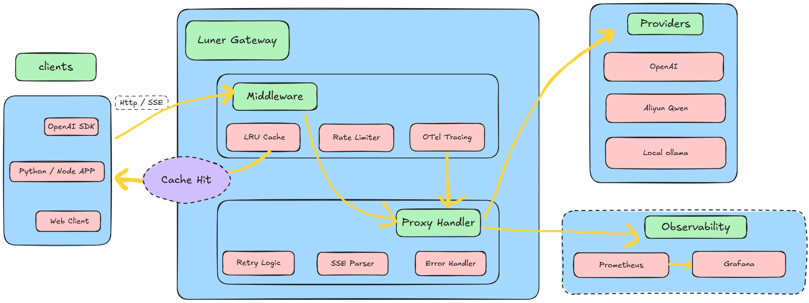

# luner

<p align="center">
  <strong>English</strong> | <a href="README.zh.md">中文</a>
</p>

[](https://github.com/your-org/luner/releases)
[](https://go.dev/)
[](https://docs.docker.com/compose/)
[](https://github.com/skylunna/luner/blob/main/LICENSE)


A lightweight LLM API gateway that can be used for production. Seamlessly proxy, cache, rate limit, and observe your AI workload using OpenAI compatible interfaces. Specially designed for cloud native environments and developers to prioritize experience.

---



---

## ✨ Features


- **OpenAI Compatible**: Drop-in replacement for `base_url`. Zero code changes for existing Python/Node.js SDKs.
- **High Performance**: Zero-dependency LRU cache + token-bucket rate limiting. Pure Go, constant memory footprint.
- **Hot-Reload Configuration**: Atomic config updates via `fsnotify` & `atomic.Pointer`. Zero downtime routing changes.
- **Full Observability**: OpenTelemetry tracing + Prometheus metrics (latency, token usage, cache hits, rate limits).
- **Cloud-Native Ready**: Multi-arch binaries, multi-stage Dockerfile, `docker-compose` out-of-the-box.
- **Secure by Design**: Environment variable injection, `.env` templating, 12-Factor App compliant.

---

## 🚀 Quick Start
[](https://github.com/your-org/luner/releases)

### Option 1: Demo Mode — one command, instant dashboard (recommended for evaluation)

```bash
git clone https://github.com/skylunna/luner.git
cd luner

# Build image and start everything (mock LLM + luner + sample data)
docker compose up -d --build

# Wait ~30 seconds for the image build and seed step
docker compose logs -f seed-data   # watch until "Demo data ready"
```

Open **http://localhost:8080** — you'll see 8+ traces, cost charts, and a pre-loaded trace timeline.

```bash
# Verify
curl http://localhost:8080/api/health
curl http://localhost:8080/api/dashboard/summary

# Stop and clean up
docker compose down            # keeps data volume
docker compose down -v         # also removes the database
```

### Option 2: Production Mode — real LLM providers

```bash
cd deployments/production
export OPENAI_API_KEY=sk-...
docker compose -f docker-compose.prod.yml up -d --build
```

### Option 3: From Source

```bash
make build                          # builds web + Go binary
./bin/luner --config config/config.example.yaml
```

### Option 4: With Full Monitoring Stack (Prometheus + Grafana + Tempo)

```bash
docker compose -f docker-compose.yml -f docker-compose.monitoring.yml up -d
# Grafana: http://localhost:3000  (admin / admin)
# Prometheus: http://localhost:9091
```

### Troubleshooting

| Symptom | Fix |
|---|---|
| `seed-data` exits immediately | Check `docker compose logs luner` — luner may still be starting |
| Port 8080 already in use | `lsof -ti:8080 \| xargs kill` or change the port mapping |
| Image build fails (Go proxy) | `GOPROXY=https://goproxy.io,direct docker compose build` |
| No data on dashboard | Run `docker compose run --rm seed-data` to re-seed |

## Configuration
`luner` separates routing logic from secrets. Modify `config/config.yaml` at any time; changes apply automatically.
```yaml
# config/config.yaml
providers:
  - name: openai-prod
    base_url: "https://api.openai.com/v1"
    api_key: "${OPENAI_API_KEY}"  # Injected from .env
    models: ["gpt-4o", "gpt-4o-mini"]
    timeout: "30s"

cache:
  enabled: true
  max_items: 5000
  default_ttl: "2h"

rate_limit:
  enabled: true
  providers:
    - name: openai-prod
      qps: 50.0
      burst: 10
```
> **Hot-Reload**: Edit config.yaml and save. The gateway atomically swaps the routing table without dropping active connections.

## Client Integration
Works with any OpenAI-compatible client. Just update `base_url`.
### Python (uv + openai)
```bash
cp .env.example .env  # Configure 
cd examples/python-sdk
AI_GATEWAY_BASE_URL & API_KEY
uv run python test_integration.py
```
### Code Example
```python
from openai import OpenAI

client = OpenAI(
    api_key="sk-xxx",  # Placeholder, overridden by gateway
    base_url="http://localhost:8080/v1"
)
response = client.chat.completions.create(
    model="gpt-4o-mini",
    messages=[{"role": "user", "content": "Hello"}]
)
```

## Observability
- **Metrics:** `GET /metrics` (Prometheus format)
  - `aigw_requests_total{status="200-cache"}` → Cache hit ratio
  - `aigw_request_duration_seconds` → Latency distribution
  - `aigw_tokens_used_total{type="prompt|completion|total"}` → Token accounting
- **Tracing:** Set `OTEL_EXPORTER_OTLP_ENDPOINT` to auto-export spans to Jaeger/Tempo
- **Health:** `GET /health` (K8s compatible)

---

## 📈 Performance Benchmarks

Tested on: **Ubuntu 22.04 / 8 vCPU / 16GB RAM** (production target)  
Tooling: `hey -c 50 -n 1000` | [🔗 Reproduce script](scripts/bench.sh)

| Scenario | QPS | P50 Latency | P99 Latency | Cache Hit | Upstream Calls | Memory (RSS) |
|----------|-----|-------------|-------------|-----------|----------------|--------------|
|  Cache Hit (`prompt+model+temp=0`) | **32,082** | **1.3ms** | **6.9ms** | **100%** | **0** | ~42MB |
|  Cold Start (first request) | ~95 | ~380ms | ~1.1s | 0% | 100% | ~45MB |
|  Direct to Upstream (baseline) | ~88 | ~365ms | ~1.0s | N/A | 100% | N/A |
|  Rate Limited (`qps=10, burst=2`) | ~10 | ~45ms | ~180ms | variable | throttled | ~43MB |

>  **Cache Hit**: Same `prompt+model+temperature=0` request returns from in-memory LRU cache. Zero network overhead.  
>  **Cold Start**: First request includes upstream latency + proxy routing (~5-10ms overhead).  
>  **Cross-Platform**: Binaries provided for Linux/macOS/Windows. Benchmark results vary by OS scheduler & Docker runtime; use `scripts/bench.sh` to test your environment.

--- 

## Contributing
PRs, issues, and feedback are welcome. See [CONTRIBUTING.md](CONTRIBUTING.md) for setup guidelines, commit conventions, and `good first issue` labels.